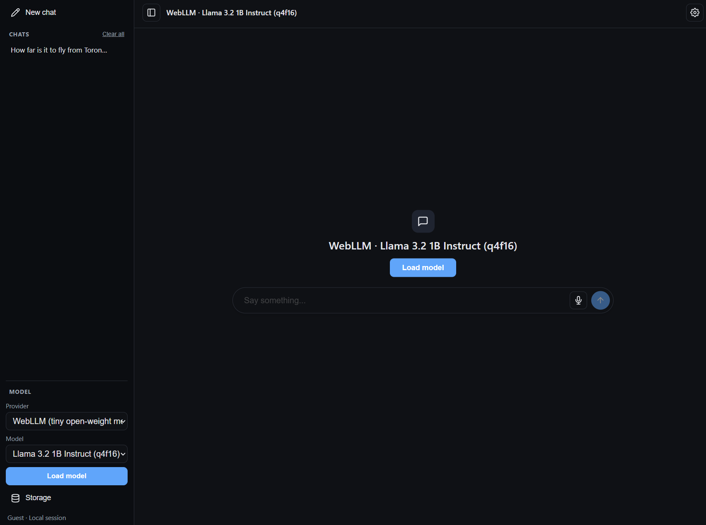

# localai

A simple local-frist chat interface that runs **entirely in the browser**: no server, no API key, no data leaving your machine.

It's a single-page, no-build-step app (`index.html` + `app.js` + `style.css`) that switches between several client-side inference options — [WebLLM](https://github.com/mlc-ai/web-llm), [Transformers.js](https://github.com/huggingface/transformers.js), and Chrome's built-in Gemini Nano — with a familiar ChatGPT/OpenWebUI-style UI, persisted chat history in localstorage.

# Demo



[https://local.janus.ai](https://local.janus.ai)

## Running it

WebGPU and ES module imports require the page to be served over `http(s)://`, not opened directly as a `file://` URL:

```sh
python3 -m http.server 8000
# or: npx serve .
```

Then open `http://localhost:8000` in a recent Chrome or Edge, pick a provider from the dropdown, click "Load model", and start chatting (or upload an image, for the captioning/image-Q&A providers).

## External dependencies

There's no build step and no `package.json` — every library is loaded at runtime straight from a CDN (`esm.run`) via dynamic `import()`, unpinned to a specific version:

- [`@mlc-ai/web-llm`](https://github.com/mlc-ai/web-llm) — WebGPU-based inference for the WebLLM chat provider
- [`@huggingface/transformers`](https://github.com/huggingface/transformers.js) — ONNX-based inference (WebGPU or WASM), used by the Transformers.js chat provider, image captioning, image Q&A (VQA), and speech-to-text (Whisper ASR)
- [`marked`](https://github.com/markedjs/marked) — renders assistant replies as markdown
- [`dompurify`](https://github.com/cure53/DOMPurify) — sanitizes marked's HTML output before it's inserted into the DOM

Chrome's built-in Gemini Nano provider uses the browser's native `LanguageModel` Prompt API and has no separate library dependency.

See [CLAUDE.md](CLAUDE.md) for full architecture notes, provider/model details, and known issues.
